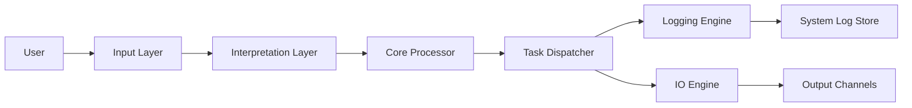

# WM-Core_801# WM-Core_801  
## ✈️ 2) ระบบแบบ Core Flow

---

### ✔️ จุดทำต่อให้เลย
1. **จะผูกทุกอย่างเข้าไฟล์ระบบเดียวก่อน**
2. งานเริ่มสร้างระบบพื้นฐาน
3. กฎเปลี่ยนชื่อ “จะ*ยืนยันการเปลี่ยนแปลง*”

พร้อมให้ลุงทำหน้า 17 ต่อ (System Deep Audit) บอกได้เลย ❤️
